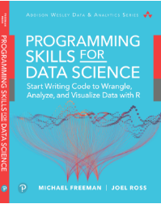

## Rihad's take on building Web-Applications

### What You'll Learn
How to write code to work with data. Using the R software, you will programmatically work with real datasets to build interactive visualizations, web applications, and well-crafted data reports.

### Details
Programming Skills for Data Science is a comprehensive primer for people seeking data science skills that can be applied across a variety of domains. With no background experience required, this text covers the following:

* Install (free) data science software to write, execute, and manage code
* Manage and collaborate on projects efficiently with the version control systems git and GitHub
* Understand the foundational programming concepts and data structures (of the R programming language) for working with quantitative information.
* Load, format, explore, and wrangle data for successful analysis
* Interact with complex data sources, including CSV files, databases, and web APIs
* Design and build interactive visualizations that are accurate, engaging, and intuitive
* Build interactive web applications to facilitate the data science process.
