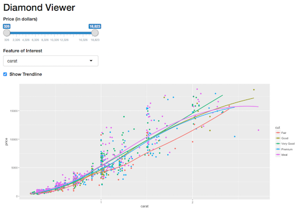

## Shiny App With Diamonds

In this project, I'll practice building a Shiny application with more extensive communication between the UI and server. The final product will be a plot of the `diamonds` dataset exploring the influence of different features on price:

